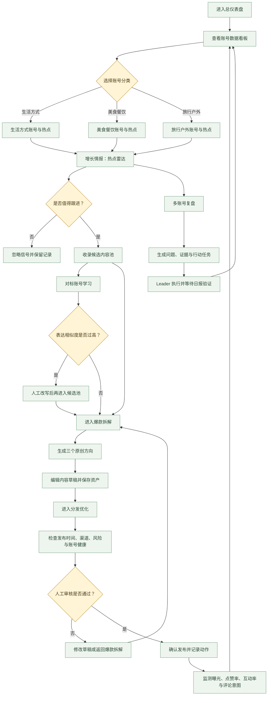

# Growth OS 操作流程图

这张图用于演示运营人员如何从账号经营看板进入内容增长闭环。图中的分类会在账号看板和热点雷达之间保持一致：生活方式、美食餐饮、旅行户外。

## 页面对应关系

| 流程节点 | 网站页面 | 主要操作 |
| --- | --- | --- |
| 总仪表盘 | 总仪表盘 | 查看账号数量、曝光、点赞率、互动率和风险 |
| 账号分类与热点 | 增长情报 | 按生活方式、美食餐饮、旅行户外筛选热点 |
| 多账号复盘 | 增长情报 | 查看问题、证据、Leader 任务和日报 |
| 对标学习与候选池 | 增长情报 | 判断机制可借鉴性，拦截高表达相似度内容 |
| 爆款拆解 | 爆款拆解 | 拆解结构并生成三个原创方向 |
| 分发优化 | 分发优化 | 检查发布时间、渠道、风险和人工审核 |
| 数据回流 | 总仪表盘 / 增长情报 | 根据发布后的数据更新下一轮经营判断 |

## 答辩时的一句话解释

Growth OS 不是把五个任务并列摆放，而是把它们串成一条可执行链路：先看账号经营状态，再按账号垂类找热点，经过复盘和对标形成候选内容，完成二创和分发审核，最后用发布数据回流到下一轮账号决策。
